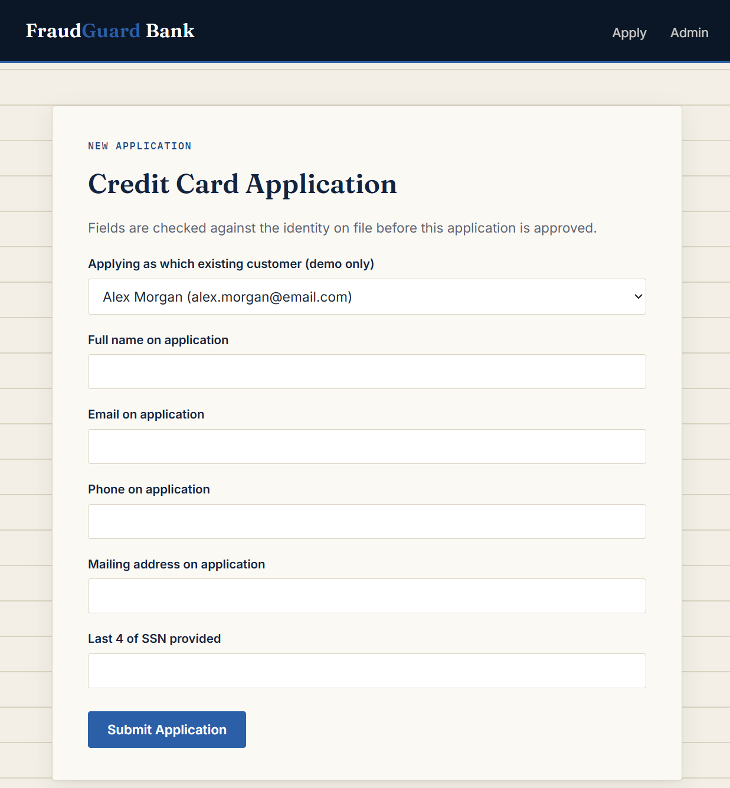

# FraudGuard Bank

A working simulation of credit card application fraud — and how step-up identity verification, tied to a customer's real on-file contact information, can stop it before an account is ever opened.

**Live demo:** https://fraudguard-bank-oo5d.onrender.com
*(Free-tier hosting — the first load after a period of inactivity can take 30-50 seconds to wake up.)*

**Admin dashboard demo login:** available on request, or explore the applicant-facing flow at `/apply`.

---

## The Problem

This project was inspired by a personal fraud experience: a credit card was opened under my name without my knowledge, and I only found out because the person behind it made a mistake — they added the card to a mobile wallet using their own device, which triggered an email notification to my inbox. If they hadn't made that mistake, I likely wouldn't have found out until the account was already delinquent.

That raised an obvious question: **why didn't I get verified before the account was opened in the first place?** In most cases, identity verification at account opening checks whether the *application data* is internally consistent (does this SSN/name/DOB combination exist in bureau records?) — not whether the *person applying* is actually who they claim to be. Real-time, out-of-band verification (e.g., confirming with the real person via their actual on-file contact info) is the fix, but it's often skipped because it adds friction.

FraudGuard Bank is a small, working system that closes that gap.

## What This Project Does

1. A user submits a credit card application (`/apply`)
2. The system compares the submitted information against what's actually on file for the real account holder, and computes a rules-based **risk score**
3. Every application — regardless of risk score — triggers a **step-up verification request** sent to the real account holder's on-file contact info (simulated in this demo, since there's no real email/SMS provider wired in)
4. The real account holder reviews the application details side-by-side with what's on file, and explicitly approves or denies it
5. Only confirmed applications are approved; anything denied is marked as fraud
6. An internal **admin dashboard** shows every application, its risk score, and its outcome

## Security Features

This project doubles as a small case study in common web application vulnerabilities and their fixes:

- **Server-side input validation** — every field is validated on the server, not just in the browser, since client-side checks can be bypassed by sending requests directly
- **Environment-based secrets management** — the Flask secret key, database URL, and admin password are read from environment variables, never hardcoded or committed to source control
- **IDOR (Insecure Direct Object Reference) fix** — application confirmation pages were originally keyed by sequential, guessable IDs (`/confirmation/1`, `/confirmation/2`...); this was replaced with cryptographically random tokens so applications can't be enumerated
- **Authentication on the admin panel** — the dashboard is protected by a password-gated, session-based login instead of being publicly reachable
- **Rate limiting** — the application form and admin login are both rate-limited to blunt automated spam and brute-force password attempts

## Tech Stack

- **Backend:** Python, Flask
- **Database:** SQLite via Flask-SQLAlchemy
- **Security:** Flask-Limiter (rate limiting), python-dotenv (secrets management)
- **Frontend:** Server-rendered Jinja2 templates, custom CSS (no frontend framework)
- **Deployment:** Render (Gunicorn WSGI server)

## How the Risk Scoring Works

Each application is compared field-by-field against the real user's on-file record:

| Mismatch | Points |
|---|---|
| SSN (last 4) doesn't match | +50 |
| Email doesn't match | +20 |
| Phone doesn't match | +15 |
| Mailing address doesn't match | +15 |

A score of 30 or higher marks the application as flagged, though — importantly — **every** application requires step-up verification regardless of score, since a risk score alone can't prove the real person applied.

## Running Locally

```bash
git clone https://github.com/sadafrasooli5-png/fraudguard-bank.git
cd fraudguard-bank
python -m venv venv
venv\Scripts\activate        # Windows
# source venv/bin/activate   # macOS/Linux

pip install -r requirements.txt
cp .env.example .env         # then fill in real values in .env

flask --app app init-db
flask --app app seed-db
python app.py
```

Visit `http://localhost:5000`.

## Future Improvements

- Replace the rules-based scoring engine with a trained ML model (logistic regression or gradient boosting) evaluated on precision/recall tradeoffs
- Real email/SMS delivery for verification requests instead of the in-app demo link
- Multi-factor authentication for the admin panel
- Persistent database (PostgreSQL) for production use instead of SQLite

## Author

Sadaf Rasooli — Computer Science student, Cybersecurity concentration, AI minor

## Screenshot
